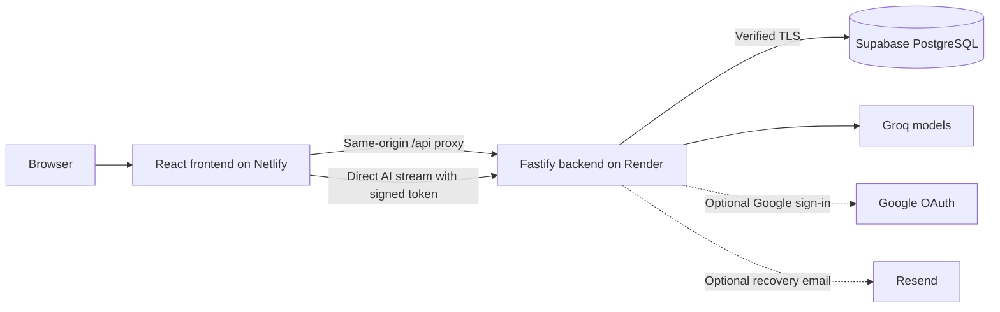

# Argulab

**Practice the conversation before it matters.**

Argulab is an AI communication practice app for building clearer arguments, preparing for interviews, and thinking on your feet. Choose a scenario, work through a conversation, and leave with a review of your reasoning, evidence, and communication.

[Open the live app](https://argulab.netlify.app) · [Deployment guide](docs/DEPLOYMENT.md) · [Build status](https://github.com/Laabh-Gupta/mindforge-ai-debate/actions/workflows/ci.yml)

## What you can do

- **Practice in nine modes:** debate, group discussion, interview, public speaking, extempore, negotiation, case discussion, real-world simulation, and observer analysis.
- **Shape the session:** choose a topic, difficulty, and supported format or role; practice in English, Hindi, or a mix of both.
- **Get specific feedback:** review strengths, weak claims, evidence, logical fallacies, counterarguments, and suggested next steps.
- **Pick up where you left off:** resume unfinished sessions and revisit completed transcripts and reviews.
- **Track your practice:** see skill trends, activity, streaks, achievements, and an optional public leaderboard profile.
- **Keep a copy:** download text reports, print or save reports as PDF, and export your practice data as JSON. Browser audio recording supports playback and download.

You can start as a guest. Guest history stays in that browser; signing in with email and password gives you account history stored in PostgreSQL. Reviews assess the submitted text; recording audio does not automatically transcribe or score vocal delivery. Scores are coaching estimates.

## Live deployment

| Component | Technology                                                | Hosting                                     |
| --------- | --------------------------------------------------------- | ------------------------------------------- |
| Frontend  | React 19, TypeScript, Vite, TanStack Router, Tailwind CSS | [Netlify Free](https://argulab.netlify.app) |
| Backend   | Fastify, TypeScript, Better Auth, AI SDK                  | Render Free                                 |
| Database  | PostgreSQL through the `pg` driver                        | Supabase                                    |
| AI        | Groq                                                      | Server-side API integration                 |

Email signup/sign-in, guest debate, AI streaming, reviews, and account persistence have been verified on the deployed app. Google OAuth is implemented but is **not enabled on the live deployment yet** because Google Cloud project setup is pending. Password-reset emails also require a configured mail provider and verified sender.

Free hosting has usage limits and may sleep or pause while inactive. The app shows a connection message while the backend wakes up. See the [deployment guide](docs/DEPLOYMENT.md#4-free-tier-expectations-and-launch-checks) for operating limits and launch checks.

## How it works



The frontend and backend have separate source directories and deployment targets. Authentication and saved history use Netlify's same-origin API proxy. AI streaming connects directly to Render with a short-lived token so long responses do not depend on the proxy's request timeout.

Better Auth manages accounts on the backend. Supabase provides the PostgreSQL database; **Supabase Auth and a Supabase browser client are not required**. The backend checks record ownership and keeps its tables in the private `mindforge` schema, outside the public Data API. There is no SQLite fallback in production.

## Run locally

Requires **Node.js 22.13+** and **Bun 1.4**. Run package commands from the repository root; both applications share `package.json` and `bun.lock`.

```sh
git clone https://github.com/Laabh-Gupta/mindforge-ai-debate.git
cd mindforge-ai-debate
bun install --frozen-lockfile
```

Create environment files if they do not already exist. These commands work in Git Bash, macOS, and Linux shells:

```sh
[ -f backend/.env ] || cp backend/.env.example backend/.env
[ -f frontend/.env ] || cp frontend/.env.example frontend/.env
```

Fill in `backend/.env`:

| Variable          | Purpose                                                                        |
| ----------------- | ------------------------------------------------------------------------------ |
| `DATABASE_URL`    | Supabase Session pooler PostgreSQL URI, with the database password URL-encoded |
| `AUTH_SECRET`     | Stable random secret for authentication, at least 32 characters                |
| `SESSION_SECRET`  | Separate stable random secret for signed visitor and AI tokens                 |
| `GROQ_API_KEY`    | Groq API credential                                                            |
| `FRONTEND_ORIGIN` | Exact frontend origin; locally `http://127.0.0.1:3001`                         |
| `PORT`            | Backend port; defaults to `4000`                                               |

Generate each secret separately and save it in the environment file:

```sh
node -e "console.log(require('crypto').randomBytes(48).toString('base64url'))"
```

In the backend terminal, trust the included public Supabase CA certificate, then start the API:

```sh
export NODE_EXTRA_CA_CERTS="$PWD/backend/certs/supabase-prod-ca-2021.crt"
bun run dev:backend
```

For PowerShell, set the certificate path with `$env:NODE_EXTRA_CA_CERTS=(Resolve-Path 'backend/certs/supabase-prod-ca-2021.crt').Path`. The connection uses certificate verification; do not disable it.

In a second terminal at the repository root:

```sh
bun run dev
```

Open **http://127.0.0.1:3001**. The backend runs at **http://127.0.0.1:4000**, and Vite proxies local `/api` requests. Leave `VITE_BACKEND_ORIGIN` empty locally to use that proxy. Use the same hostname as `FRONTEND_ORIGIN` for account cookies and origin checks.

## Models and request limits

| Setting                       | Default                 |
| ----------------------------- | ----------------------- |
| `GROQ_CHAT_MODEL`             | `openai/gpt-oss-120b`   |
| `GROQ_STRUCTURED_MODEL`       | `openai/gpt-oss-120b`   |
| `AI_REQUESTS_PER_HOUR`        | `60` per signed visitor |
| `AI_GLOBAL_REQUESTS_PER_HOUR` | `600` across the app    |
| Concurrent AI requests        | `4` per backend process |

Visitor limits are device-based; clearing cookies creates a new visitor, while the global budget still applies. Rate counters persist in PostgreSQL. Groq's own model availability and account quotas apply in addition to these application limits.

## Deploy your own

Follow the [complete deployment guide](docs/DEPLOYMENT.md) for database setup, verified TLS, environment configuration, Google OAuth, email delivery, and the optional legacy SQLite import.

| Platform | Build and configuration                                                                                                         |
| -------- | ------------------------------------------------------------------------------------------------------------------------------- |
| Netlify  | Repository root; `bun run build:frontend`; publish `frontend/dist`; public `VITE_BACKEND_ORIGIN` set to the Render origin       |
| Render   | `backend/Dockerfile`, repository-root build context, `/api/health` health check, backend secrets in Render environment settings |
| Supabase | Session pooler connection; private application schema; database credential used only by the backend                             |

`netlify.toml` defines the frontend build, and `render.yaml` provides a backend Blueprint. Pushes to `main` are connected to the existing production deployments.

To enable optional integrations, configure these **on the backend**:

- **Google sign-in:** `GOOGLE_CLIENT_ID` and `GOOGLE_CLIENT_SECRET`. Register `<FRONTEND_ORIGIN>/api/auth/callback/google` as the OAuth redirect URI.
- **Password recovery:** `RESEND_API_KEY` and `MAIL_FROM` from a verified sender domain. Email/password sign-in works without them.

## Repository layout

```text
frontend/       React app, routes, UI, guest history
backend/        API, authentication, AI, persistence, Dockerfile
shared/         Practice schemas, evaluation types, participant metadata
scripts/        Build, deployment, migration, and verification tools
tests/          Unit, integration, and browser tests
docs/           Deployment documentation
supabase/       Historical schema and migrations
```

The repository URL and some internal identifiers retain the original MindForge name. Database schema, cookie names, and browser storage keys remain stable so the Argulab rename preserves existing accounts and practice history.

## Verification

```sh
bun run lint
bun run typecheck
bun run test
bun run build
bunx playwright install chromium
bun run test:e2e
bun run test:persistence
bun run test:import
```

Local tests use an isolated PostgreSQL-compatible PGlite server. CI also checks against PostgreSQL. Browser tests start their own frontend and backend servers; the test suite does not need production database credentials or make real AI calls.

Before publishing, check both source/history and the built frontend for configured secrets:

```sh
node --env-file=backend/.env scripts/verify-secrets.mjs
node --env-file=backend/.env scripts/verify-client.mjs
```

Keep credentials in ignored `.env` files locally and backend environment settings in production. Only public configuration belongs in `VITE_` variables. Commit the example environment templates, never actual credentials, database backups, or private deployment artifacts.
